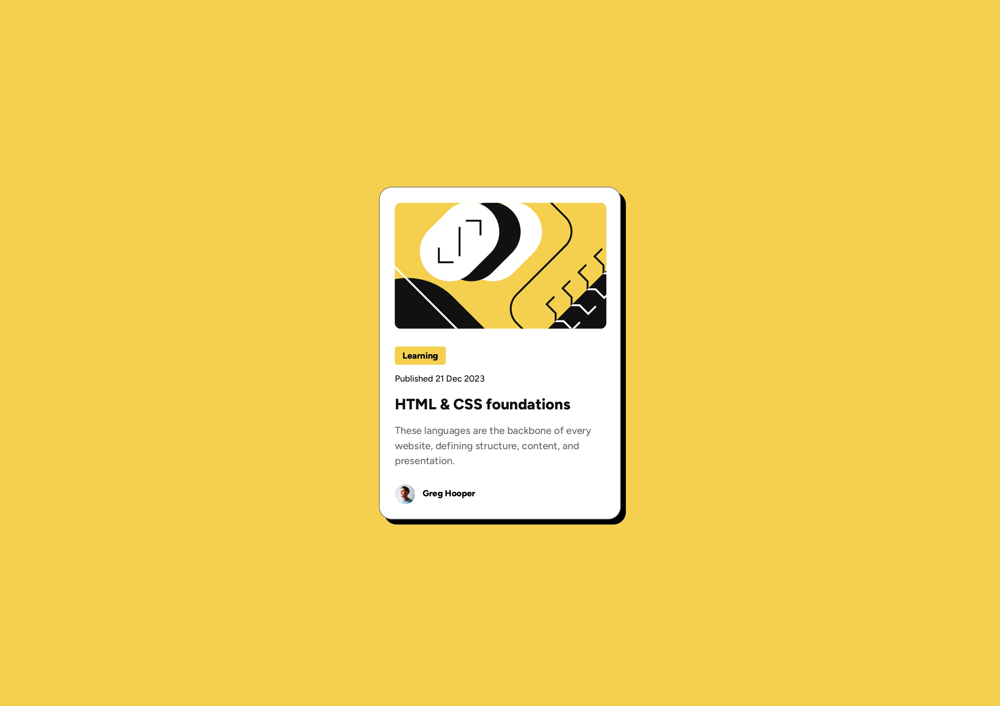

# 📖 Blog Preview Card
Welcome to the **Blog Preview Card** Page project!

A simple and responsive beginner-friendly web development project built with **HTML and CSS**, inspired by **frontend mentor**.

## 📌 Overview  

### The challenge ⚡
Build a responsive **blog preview card** that displays a blog card with an image, titles, and publish dates and some content. Using semantic HTML for accessibility and readability. Appliing modern CSS techniques.
The design should adapt well across desktop, tablet, and mobile screen sizes.


### The page includes 📋
- A main heading with an overview of the articles
- A featured blog image
- A category tag to highlight blog type
- A published date
- A blog title with hover effect
- A short description of the blog
- An author section with avatar and name
- Responsive design for desktop, tablet, and mobile
- Clean typography using Google Fonts (Figtree)

### Screenshot 📱
  


### Links 🔗
- Solution URL: [GitHub Repository](https://github.com/sameer-srb/blog-preview-card)  
- Live Site URL: [Live Demo](https://blog-preview-card-fm1.netlify.app)


## 💡 My process

### Built with ⚙️
- Semantic **HTML5** markup  
- **CSS3 Flexbox** for layout
- **CSS custom properties**
- **Responsive design** with media queries  
- **Google Fonts (Poppins)** for typography  

### What I learned 📑
- ✨I mprove my understanding of **semantic HTML** structure.
- 🎨 Use **CSS variables** for better consistency and maintainability.
- 📐 Create **responsive card layouts** that adapt to small screens.
- 🖱️ Implement **hover effects** for better interactivity.  
- 📝 Writing clean and meaningful **CSS comments** for maintainability.  

```css
h1:hover {
  color: var(--color-yellow);
  cursor: pointer;
}
```

### Useful resources 📚 
- [MDN Web Docs – HTML](https://developer.mozilla.org/en-US/docs/Web/HTML)  
- [MDN Web Docs – CSS](https://developer.mozilla.org/en-US/docs/Web/CSS) 
- [devChallenges](https://devchallenges.io/challenge/join-our-newsletter)  
- [Google Fonts (Popins)](https://fonts.google.com/specimen/Poppins)


## 🙏 Acknowledgments
Special thanks to **frontend mentor** and **MDN Docs** for helpful resources during the development.


## 📬 Feedback
Suggestions or improvements welcome!  
Feel free to open an issue or reach out.

**Author :-**

[](https://www.linkedin.com/in/sameer-barik-a509672ba/) - [](https://github.com/sameer-srb) - [](https://x.com/sameer_srb) 

Created by **SAMEER** - 2025
